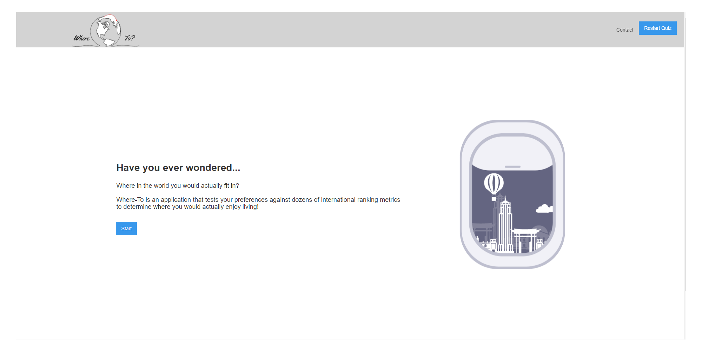
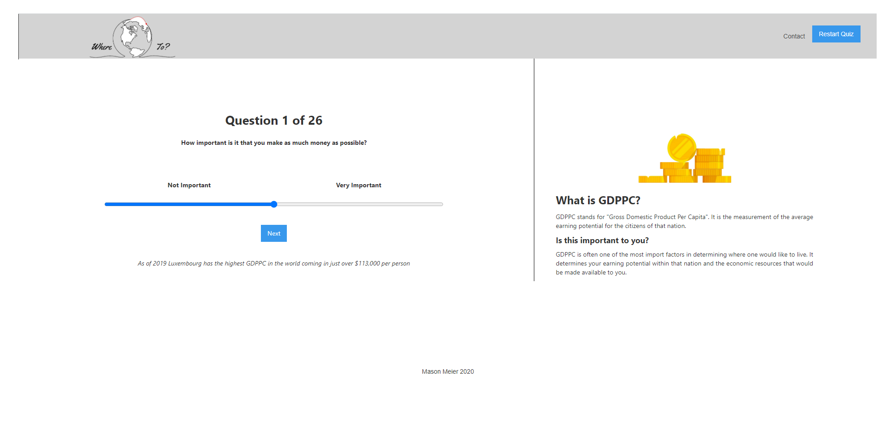
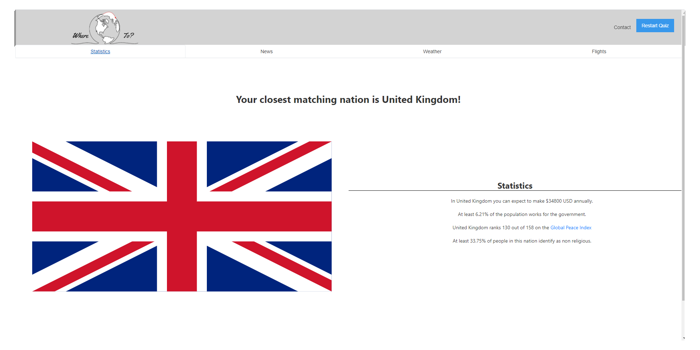
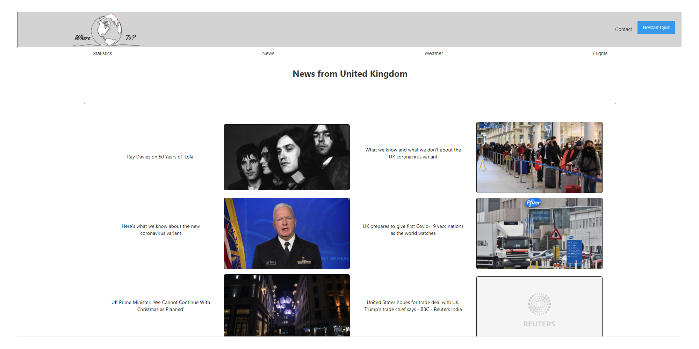
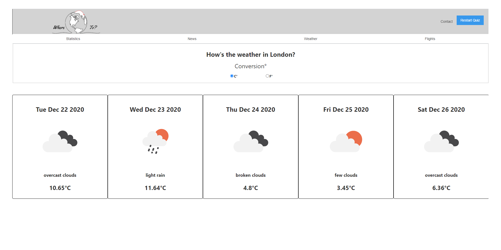

Where-To Backend
link to live project:
https://where-to.world/

Documentation for API's used:
https://newsapi.org/
https://openweathermap.org/api

********Summary:********
Front End:
This is an application built with React.js. The user is prompted through a series of questions about their personal
values and what sort of environments they prefer. As the user submits each question, the slider position is saved. At
the end of the quiz, the slider positions are compared to international ranking metrics. Countries closely associated
to the values selected are awarded points in an area sorrounding the closest matching nation. The closest matching 
nation recieves the largest volume of points. Once the database has been fetched and the comparisons have been run, 
the user is presented with the highest placed nation that most closely aligns to what they value. They also recieve 
news, weather and flight data on that nation. 

Back End: 
The back end for the where-to react client is built with express. When hit, based on the endpoint, it will either return
information from-
A. The SQL Database
B. The News API
C. The Weather API
D. Post to the user SQL database.

*********End Summary*********

Technology Used:
HTML
CSS
Javascript
ReactJS
ExpressJS
PostgreSQL
Rest API
Mocha 
Chai
AWS
EC2 Instance
SSL Certification

Screenshots:
Landing Page

Question

Results

News

Weather

